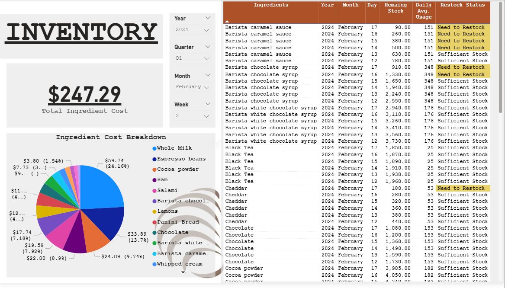
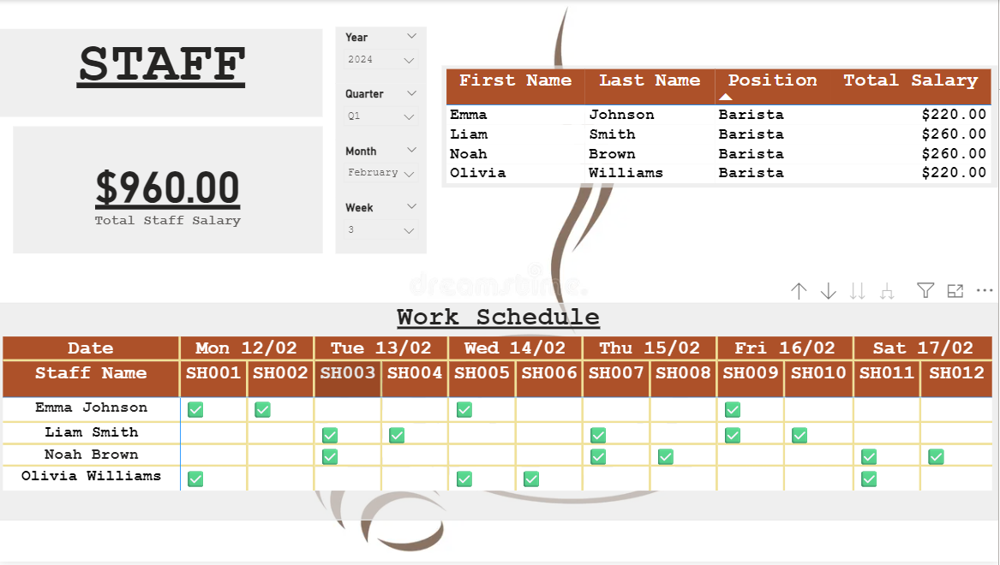

# Café Business Dashboard – Inventory, Staff & Revenue Insights
This project aims to build a management dashboard using PowerBI to track store revenue, monitor ingredient consumption and stock levels, and oversee staff scheduling. The data was preprocessed and cleaned using SQL before being visualized to support decision-making and optimize daily operations for a coffee and baguette shop.

## 1. Data Source

This dataset was originally published by the author Vira Mtvchk on the Kaggle platform. It consists of eight tables, each representing a different aspect of the business operation.

Link: [Coffee Shop Sales/Inventory/Staff☕️](https://www.kaggle.com/datasets/viramatv/coffee-shop-data)

- **Orders**: Records of customer orders, including order IDs, timestamps, item IDs, quantities, customer names, and whether the order was for dine-in or takeout.
- **Items**: Details of menu items, including item IDs, SKUs, names, categories, sizes, and prices.
- **Recipes**: Information on how each menu item is made, listing required ingredients and quantities.
- **Ingredients**: A list of ingredients used in the coffee shop, including their IDs, names, weights, measurements, and prices.
- **Inventory**: Current stock levels of each ingredient.
- **Staff**: Information on coffee shop staff, including their IDs, names, positions, and salary rates.
- **Shift**: Details of work shifts, including shift IDs, days, start times, and end times.
- **Rota**: Staff work schedules, linking staff members to specific shifts.

## 2. Data Cleaning and Transformation (MS SQL)

After being downloaded as .csv files, the tables were imported into SQL Server Management Studio (SSMS) under a single database. From there, the data was cleaned and transformed to prepare it for building the dashboard. The final tables prepared for the dashboard include: 

### **orders**

Null and blank values in the `in_or_out` column were filled using valid values from other items within the same order. Additionally, products with invalid `item_id` values (not found in the **items** table) were filtered out.

```sql
SELECT
	*
FROM (
    -- Fill NULL or blank 'in_or_out' values
SELECT  
    row_id,
	order_id, 
    created_at,
	item_id, 
	quantity, 
	cust_name, 
    CASE 
        WHEN in_or_out IS NOT NULL
            AND LTRIM(RTRIM(in_or_out)) NOT LIKE ''
            THEN in_or_out
        ELSE MAX(CASE 
                    WHEN in_or_out IS NOT NULL
                        AND LTRIM(RTRIM(in_or_out)) NOT LIKE ''
                        THEN in_or_out
                    END) OVER (PARTITION BY order_id)
        END AS in_or_out
FROM 
    orders
) AS sub_query
WHERE 
    -- Remove invalid item_ids
    item_id LIKE 'It___' AND 
    item_id BETWEEN 'It001' AND 'It024'
```

### **items**

Round the `item_price` column to two decimal places to ensure consistent formatting and accuracy in price calculations.

```sql
    -- Round item_price to 2 decimal places
SELECT
	item_id, 
	sku, 
	item_name, 
	item_cat, 
	item_size, 
	ROUND(item_price, 2) AS item_price
FROM
	items
```

### **ingredients**

Round the `ing_price` column to two decimal places to ensure consistent formatting and accuracy in price calculations.

```sql
    -- Round ing_price to 2 decimal places
SELECT
	ing_id, 
	ing_name, 
	ing_weight, 
	ing_meas, 
	ROUND(ing_price, 2) AS ing_price
FROM
	ingredients
```


### **restock_status**

A new table was created to monitor ingredient stock levels and identify restocking needs. This table was built by joining data from the **orders**, **items**, **ingredients**, and **inventory** tables. The process calculates daily ingredient usage, remaining stock over time, and applies a rule-based condition to flag low-stock items using SQL window functions.

```sql
WITH daily_used AS (
    -- Aggregate the total quantity of each menu item ordered per day
SELECT
	i.item_id, 
	i.item_name,
	i.item_size,
	i.sku,
	CAST(o.created_at AS DATE) AS order_date,
	SUM(o.quantity) AS daily_total
FROM orders o
	LEFT JOIN items i ON o.item_id = i.item_id
WHERE
	i.item_id IS NOT NULL
GROUP BY 
	i.item_id, 
	i.item_name, 
	i.item_size, 
	i.sku, 
	CAST(o.created_at AS DATE)
), 

f_daily AS (
    -- Calculate total ingredient usage per day based on recipe proportions
SELECT
	ing.ing_name, 
	r.ing_id,
	du.order_date, 
	SUM(du.daily_total * r.quantity)AS daily_u
FROM
	recipe r
	LEFT JOIN daily_used du ON r.recipe_id = du.sku
	LEFT JOIN ingredients ing ON ing.ing_id = r.ing_id
GROUP BY
	ing.ing_name,
	r.ing_id,
	du.order_date
)
    -- Calculate remaining stock over time and determine restock status
SELECT
	fd.ing_name, 
	fd.ing_id, 
	fd.order_date, 
	fd.daily_u, 
        -- Convert inventory stock units to match the unit used for ingredient consumption
	(inv.quantity * CAST(ing.ing_weight AS FLOAT)) - SUM(fd.daily_u) OVER (PARTITION BY fd.ing_id ORDER BY fd.order_date) AS remain_ing, 
	AVG(fd.daily_u) OVER (PARTITION BY fd.ing_id) AS avg_daily_used, 
	CASE 
		WHEN (inv.quantity * CAST(ing.ing_weight AS FLOAT)) - SUM(fd.daily_u) OVER (PARTITION BY fd.ing_id ORDER BY fd.order_date) <= 4*(AVG(fd.daily_u) OVER (PARTITION BY fd.ing_id))
		THEN 'Need to Restock' ELSE 'Sufficient Stock' END AS restock_status
 FROM
	f_daily fd
	LEFT JOIN inventory inv ON fd.ing_id = inv.ing_id
	LEFT JOIN ingredients ing ON fd.ing_id = ing.ing_id
ORDER BY
	fd.order_date
```

### **shift**

In the **shift** table, a new field `worked_hr` was created to calculate the number of hours in each shift based on the start and end times.

```sql
    -- Calculate working hours for each shift
SELECT 
	shift_id, 
	day_of_week, 
	start_time, 
	end_time, 
	DATEDIFF(HOUR, start_time, end_time) AS worked_hr
FROM shift
```

### **staff**

The `sal_per_hour` column was originally stored as a time value (hh:mm:ss). It was converted into a numeric format (FLOAT) using DATEDIFF to enable salary calculations based on hours worked.

```sql
    -- Convert 'sal_per_hour' from time format to numeric hour value for salary calculations
SELECT
	staff_id, 
	first_name, 
	last_name, 
	position, 
	CAST(DATEDIFF(HOUR, '00:00:00', sal_per_hour) AS FLOAT) AS sal_per_hour
FROM staff
```

### **recipe** & **rota**

No transformation was needed

## 3. Building the Dashboard in PowerBI

After data cleaning and transformation in SQL, the processed tables were imported into PowerBI for data modeling and dashboard design. To support the visualizations, several DAX measures and calculated columns were created to perform dynamic calculations, apply conditional logic, and generate key performance indicators. These calculations enabled interactive visuals such as KPI cards, conditional tables, restocking alerts, and financial summaries. The report includes three dashboards:

### **Revenue**

The **Revenue** dashboard provides a consolidated view of sales performance over time, enabling stakeholders to explore and act on the following insights:

- **Revenue peaks by time**: sales volume fluctuates significantly based on the hour of the day and day of the week, helping identify high-traffic periods for staffing and promotional strategies.

- **Product demand patterns**: the top 10 best-selling products highlight which items drive the most revenue, guiding inventory prioritization and potential upsell opportunities.

- **Order type distribution**: a clear proportion of takeaway vs dine-in orders helps inform decisions on packaging resources, seating capacity, and customer service focus.

- **Temporal analysis flexibility**: slicers for year, quarter, month, and week allow users to drill down and compare performance across different timeframes, supporting both short-term and long-term planning.


### **Inventory**

The **Inventory** dashboard provides a clear overview of ingredient usage and stock availability, supporting the business in maintaining daily operations and avoiding potential supply shortages, while enabling stakeholders to explore and act on the following insights.

- **Stock level monitoring**: ingredient status is tracked through remaining quantity and average daily consumption. Items predicted to fall below a 4-day threshold are flagged in advance, allowing timely restocking and inventory planning.

- **Cost awareness**: the dashboard highlights which ingredients contribute most to total usage costs, helping the business identify areas where expenses can be optimized or monitored more closely.

- **Weekly expenditure tracking**: ingredient-related spending is summarized on a weekly basis, offering a concise view of supply-side costs and supporting better financial oversight.

- **Focused time filtering**: with filters for year, quarter, month, and week, the analysis is scoped to a selected weekly period, enabling users to explore consumption patterns and stock behavior in a time-sensitive context.



### **Staff**

The **Staff** dashboard provides visibility into workforce operations, helping managers monitor employee activity and control labor costs, and offering practical insights into how time and salary resources are allocated across the team:

- **Payroll calculation**: Employee salaries are dynamically calculated based on actual working hours and hourly wage, allowing accurate weekly payroll tracking.

- **Shift coverage tracking**: Work assignments are clearly mapped by day and shift, making it easy to identify who worked when and assess workload distribution across the week.

- **Labor cost overview**: Total staff expenses are summarized, giving management a clear picture of human resource spending during the selected period.



## 4. Business Insights & Action

### Business insights:

- High revenue dependency on limited product range

Coffee-based beverages—particularly *Cold Mocha*, *White Mocha*, and *Cappuccino* accounted for the majority of unit sales, indicating a strong product concentration. This dependency presents a business risk in the event of supply issues with key ingredients.

- Time-based sales peaks

Sales volumes peaked during 07:00–09:00 and 13:00–14:00, corresponding with typical morning and post-lunch consumer behavior. These windows represent critical revenue periods that require strong staffing and stock readiness.

- Day-of-week variability

Monday recorded the highest transaction count, while Wednesday had the lowest. This midweek slump presents an opportunity to boost traffic through targeted marketing or promotions.

- Inventory pressures on high-turnover ingredients

Key ingredients such as *Espresso beans*, *Chocolate syrup*, and *Whole milk* frequently reached “low stock” thresholds. These ingredients are directly tied to top-selling products, making stockouts a high-risk scenario.

- Operational cost breakdown

Labor cost reached $960, representing over 50% of total weekly revenue ($1,860), while inventory costs accounted for an additional $247.

- Balanced dine-in vs. to-go channel distribution

Order types were nearly split between dine-in (53.2%) and to-go (46.8%), signaling the need to optimize both on-site service and takeaway logistics for customer satisfaction.

### Suggested actions:

- Automate inventory alerts for critical ingredients

Implement dynamic reorder thresholds based on 7-day rolling average usage for fast-moving items like espresso and syrups. Schedule supplier orders at fixed weekly intervals (e.g., every Tuesday) to avoid downtime during peak hours.

- Introduce midweek promotional campaigns

Address low midweek sales by launching initiatives like “Wednesday Double Points” or limited-time offers on slow-moving products. Monitor uplift using A/B testing for campaign effectiveness.

- Optimize both dine-in and to-go experiences

For to-go: streamline packaging, reduce prep time, and promote breakfast combos during morning rush.

For dine-in: manage table turnover during peak periods and ensure sufficient seating and service capacity.

- Diversify product offering and upsell opportunities

Reduce product dependency by introducing new beverage flavors, offering limited seasonal items, and bundling coffee with baked goods to increase average order value.


